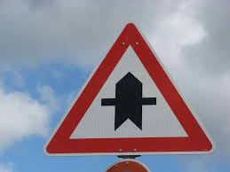

# **Traffic Sign Recognition** 

**Build a Traffic Sign Recognition Project**

The goals / steps of this project are the following:
* Load the data set (see below for links to the project data set)
* Explore, summarize and visualize the data set
* Design, train and test a model architecture
* Use the model to make predictions on new images
* Analyze the softmax probabilities of the new images
* Summarize the results with a written report

## Rubric Points
### Here I will consider the [rubric points](https://review.udacity.com/#!/rubrics/481/view) individually and describe how I addressed each point in my implementation.  

### Data Set Summary & Exploration

I used the numpy library to calculate summary statistics of the traffic
signs data set:

* The size of training set is 34799
* The size of the validation set is 4410
* The size of test set is 12630
* The shape of a traffic sign image is (32, 32, 3)
* The number of unique classes/labels in the data set is 43

Here is an exploratory visualization of the data set. It is a bar chart showing how the training data is distributed.

### Design and Test a Model Architecture

#### 1. Preprocessing
As a first step, I decided to convert the images to grayscale because we have used LeNet archtecture for classification and the same work efficiently for single channel images.

Here is an example of a traffic sign image before and after grayscaling.

As a last step, I normalized the image data because it removes unwanted high/low intensity pixel and output the pixel intensity in predefined range.

#### 2. NN Model

My final model looks like image shown abobe and consist of the following layers:

| Layer         		|     Description	        					| 
|:---------------------:|:---------------------------------------------:| 
| Input         		| 32x32x1 Grayscale image   					| 
| Convolution 5x5     	| 1x1 stride, same padding, outputs 28x28x6 	|
| RELU					| Activation function							|
| Max pooling	      	| 2x2 stride,  outputs 14x14x6 				    |
| Convolution 5x5	    | 1x1 stride, same padding, outputs 10x10x16    |
| RELU					| Activation function							|
| Max pooling	        | 2x2 stride,  outputs 5x5x16 				    |
| Fully connected		| Input 400x1 output 43x1        				|
|(Hidden layers)        |                                               |
| Softmax				| Input 43x1 output 43x1        				|
|						|												|
|						|												|
 

#### 3. Training the model

To train the model, I used an Adam Optimizer as it coverges to optimal value of weight faster which inturn speed up the batch gardient descent operation.

Have trained model on different hyper parameters but on below value model gives us the desired validation and test accuracy:

    Batch Size : 128
    Epoch : 30
    Learning rate : 0.0009

#### 4. Performance Tuning

My final model results were:
* training set accuracy of 0.996
* validation set accuracy of 0.959 
* test set accuracy of 0.934

* We have choosen LeNET architecture as its best sutable for classification of images.
* Initial arcitecture was baised for some images.
* so we have included droupout to remove overfitting from our model.
* By tuning hyper-parameters like Epochs,learning rate and batch size validation and test accuracy improved to 0.959 and 0.934 respectively.
 

#### 1. Test dataset

Here are five German traffic signs that I found on the web:

   
 

The first image might be difficult to classify because the traffic sign is not present in centre as out training set contains all the signs present in centre.

#### 2. Predictions

Here are the results of the prediction:

| Image			                        |     Prediction	        					| 
|:-------------------------------------:|:---------------------------------------------:| 
| Speed limit (60km/h)                  | No entry   									| 
| Road work    			                | Road work										|
| Stop					                | Stop											|
| No entry        		                | No entry  					 				|
| Right-of-way at the next intersection	| Right-of-way at the next intersection			|

The model was able to correctly guess 3 of the 5 traffic signs, which gives an accuracy of 60%. This compares favorably to the accuracy on the test set of images.

#### 3. Image wise softmax probablity

The code for making predictions on my final model is located in the 29th cell of the Ipython notebook.

For the first image, the model is relatively sure that this is a No entry sign (probability of 1.0), and the image does not contain a stop sign. The top five soft max probabilities were

| Probability         	|     Prediction	        					| 
|:---------------------:|:---------------------------------------------:| 
| 1.0         			| Stop sign   									| 
| .00     				| Speed limit (20km/h) 							|
| .00					| Speed limit (30km/h)							|
| .00	      			| Speed limit (50km/h)					 		|
| .00				    | Speed limit (60km/h)      					|

For the second image, the model is relatively sure that this is a Road work sign (probability of 1.0), and the image does not contain a Road work sign. The top five soft max probabilities were

| Probability         	|     Prediction	        					| 
|:---------------------:|:---------------------------------------------:| 
| 1.0         			| Double curve 									| 
| .00     				| Speed limit (20km/h) 							|
| .00					| Speed limit (30km/h)							|
| .00	      			| Speed limit (50km/h)					 		|
| .00				    | Speed limit (60km/h)      					|

For the third image, the model is relatively sure that this is a Stop sign (probability of 1.0), and the image does contain a Road work sign. The top five soft max probabilities were

| Probability         	|     Prediction	        					| 
|:---------------------:|:---------------------------------------------:| 
| 1.0         			| Stop      									| 
| .00     				| Speed limit (20km/h) 							|
| .00					| Speed limit (30km/h)							|
| .00	      			| Speed limit (50km/h)					 		|
| .00				    | Speed limit (60km/h)      					|

For the fourth image, the model is relatively sure that this is a No entry sign (probability of 1.0), and the image does contain a No entry sign. The top five soft max probabilities were

| Probability         	|     Prediction	        					| 
|:---------------------:|:---------------------------------------------:| 
| 1.0         			| No entry      								| 
| .00     				| Speed limit (20km/h) 							|
| .00					| Speed limit (30km/h)							|
| .00	      			| Speed limit (50km/h)					 		|
| .00				    | Speed limit (60km/h)      					|

For the last image, the model is relatively sure that this is a Right-of-way at the next intersection sign (probability of 1.0), and the image does contain a Right-of-way at the next intersection sign. The top five soft max probabilities were

| Probability         	|     Prediction	        					| 
|:---------------------:|:---------------------------------------------:| 
| 1.0         			| Right-of-way at the next intersection      	| 
| .00     				| Speed limit (20km/h) 							|
| .00					| Speed limit (30km/h)							|
| .00	      			| Speed limit (50km/h)					 		|
| .00				    | Speed limit (60km/h)      					|
